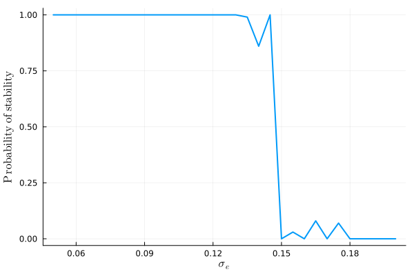
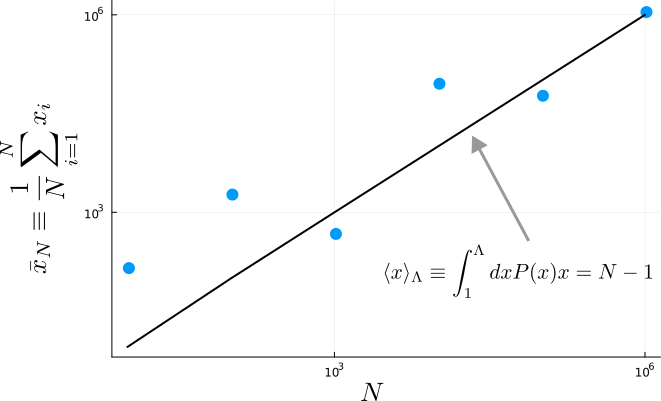

## Referee A

We thank the referee for the thoughtful review of our work and for raising important points, addressed below, which we think helped us improve the paper.

- *The claim is probably true, but unfortunately it does not describe a generic situation, because it is very hard to imagine that the exponents alpha, beta, gamma used in the model are identical for all populations. Perhaps the model would be more interesting if it included a spectrum of different exponents, described, for example, by a probabilistic law.*

We agree that indeed a spectrum of different exponents is probably more realistic, and thank the reviewer to pointing that out.

We can consider the case in which the exponents are not identical for every variable $x_i$ but instead we have them from Gaussian distributions: $\alpha_i\sim\mathcal N(\alpha,\sigma_e)$, $\beta_i\sim\mathcal N(\beta,\sigma_e)$ and $\gamma_i\sim\mathcal N(\gamma,\sigma_e)$, respectively with mean $\alpha$, $\beta$ and $\gamma$, and, for simplicity, all with the same standard deviation $\sigma_e$. 

Simulations show that all our results are robust as long as $\sigma_e$ is small enough that $\displaystyle{\min_i\beta_i>\max_i\alpha_i}$.

As an example, we show in the plot below the probability of stability vs. $\sigma_e$ for a system with $S=100$, $\mu=\mu_s=\sigma=0.01$, $\alpha=\gamma=1$ and $\beta=3/2$.
The probability of stability is obtained as the fraction of stable systems out of $100$ realizations for each value of $\sigma_e$.

We decided, however, to not include this analysis in the letter because we would like to keep the focus on the existence of the two complexity-stability regimes rather than exploring more detailed ecological scenarios. We stick to the case in which $f$, $g$ and $h$ are independent from the variable index, following references [18] and [19].

- *The way of writing the matrix elements in Equations (7) is somewhat confusing. For clarity, the Kronecker delta can be used on the right side of these equations.*

We thank the referee for this comment, we modified Equations (7) accoridngly.

- *The mean field equations depend on the expected values of <x_^\gamma> and <x_^{2\gamma}>. The self-consistency condition requires that the probability distribution (12) has exactly the same expected values. This should be discussed in detail.*

We agree with the referee that the discussion about the expected values and self-consistency conditions needed more clarifications. 

In some cases, for example $\alpha=1, \beta=3, \gamma=1$, both expectations converge to finite values and we can safely compute the self-consistency equations. However in potential case of interests, and in the example case $\alpha=1, \beta=3/2, \gamma=1$ characterized by a distribution with a power-law tail with exponent $-3/2$, the moments diverge. We now modified the discussion removing the gaussian approximation and considering the introduction of a cut-off. The idea behind this cut-off can be described by the example below.

Consider, as an example which allows for a complete analytical treatment, the case of a power law distribution 
$$
P(x)=\frac{x^{-\alpha}}{\mathcal{Z}} ,
$$
defined from 1 to $\infty$ and with 
$$
\mathcal{Z}=\int_1^{\infty}dxx^{-\alpha}.
$$

Consider the case $\alpha=3/2$. The distribution is normalized with $\mathcal{Z}=2$, but the mean diverges. However, we would like to be able to describe the behaviour of the sample mean 
$$
\bar{x}_N\equiv\frac{1}{N}\sum_{i=1}^Nx_i,
$$
where the $x_i$ are extracted from $P(x)$.
For this purpose, we can define the quantity
$$
\langle x\rangle_{\Lambda}\equiv\int_1^{\Lambda}dxP(x)x,
$$
with the cut-off $\Lambda$ defined such that $\int_{\Lambda}^{\infty}dxP(x)=1/N$, i.e., such that there is statistically less than 1 variable with value above $\Lambda$ out of $N$ extracted variables. For the case $\alpha=3/2$ we have 
$$
\frac{1}{2}\int_{\Lambda}^{\infty}dxx^{-3/2}=\Lambda^{-1/2},
$$
and therefore $\Lambda=N^2$. We have for the mean
$$
\langle x\rangle_{\Lambda}=\frac{1}{2}\int_1^{N^2}dxx^{-1/2} = N-1.
$$
The result is plotted below, alongside sample mean for extractions of $N=10,$ $10^2,$ $10^3,$ $10^4,$ $10^5,$ $10^6$.

## Referee B

We thank the referee for the thorough and critical review. We address each of the comments below point by point. We believe the results of our paper are now more transparent thanks to the work needed to address the weaknesses hihglighted by the referee. 

- *Modelling Framework Justification:*
    
     *The rationale behind the proposed generalization of the GLV model is claimed to be "natural" based on physical and biological grounds, specifically using power laws. Nevertheless, the literature extensively demonstrates species abundance growth being well-described by logistic equations or oscillatory predator-prey equations, that indeed are linear (except for the carrying capacity term). The justifications provided are weak, with the provided examples failing to convincingly represent the complex dynamics of natural systems, such as forest biomass distribution. If we think to a forest there are various heights of trees, and in general the biomass in not uniformly distributed, and thus also the growth is not necessary constrained by the surface. The sublinear scaling of the “production function”, f, if this is really the right conclusion based on the references of the manuscript, must be the result of a cooperative behavior of the interacting system and as such it should not appear as hand-added like the authors do. Furthermore, in reference 27 the sublinear scaling with k=3/4 refers to the scaling of the single individual growth rather than to a community.*

We understand the criticism of the referee, pointing out the need for better justification of models of this kind in ecology. Our goal in this letter, however, is not to propose a model for a specific ecological scenario. Rather, we employ this model for complex systems (following references [18] and [19]) to show in a minimal setting the existence of the two opposite complexity-stability relationships in disordered dynamical systems, possibly with applications beyond ecology.

Nevertheless, the examples we provide are indicative that models of this class can be relevant in ecology (see reference [17], where a discussion of possible mechanisms is present; even though admittedly more work is required in that direction, which is beyond the scope of our paper).

Finally, we are aware of the fact that reference [27] refers to the scaling of single individual, indeed we mention it to introduce the scaling at the higher level of organization:

"Biologically, the growth of organisms (populations of cells) has long been known to scale like $f (x) \sim x^k$ with $k\simeq 3/4$ [27], which can be understood in terms of hydrodynamic constraints on vascular and pulmonary networks. For reasons that are not currently understood, a similar pattern of growth appears to recur at the level of ecological communities [17, 28]".

- *Feasibility Condition Neglected:*

    *The authors do not seem to consider the condition for the feasibility of the fixed points (x\* >= 0), which is critical. This oversight, especially evident in Equations 11 and 12, i.e., Eq. 12 or its Gaussian approximation are normalized from 0 or from -infty to infty? I think this is a very relevant issue calling into question the appropriateness of the results.*

We thank the referee for raising this point.
We have now specified that the distribution in Eq.(11) is defined form zero to infinity and we point to reference [17] where a discussion on feasibility for systems described by this kind of distribution is present.

- *Lack of Proper Scaling:*
    
    *There is no proper scaling of the interactions, so the thermodynamic limit is not well defined. And this is not discussed or compared with other models in the literature applying similar disputable choice (see E Mallmin, A Traulsen, S De Monte - arXiv preprint arXiv:2306.11031, 2023). Relatedly, the comparison with GLV with quenched disorder (e.g. “The properties of large random dynamical systems is often portrayed in the ( sigma sqrt(N) , mu N ) plane [25] is not appropriate as such model scales the interactions strengths with the system size.*

The referee is absolutely correct in pointing out the lack of proper scaling in the derivation of the cavity results, we are grateful for pointing it out. We have now fixed that. However, we argue that, after a proper derivation of the analytical results, it is appropriate fix the the strength and heterogeneity of the interaction ($mean(A)=\mu$ and $var(A)=\sigma^2$) if our goal is to isolate and study the effects of changes in the number of degrees of freedom. We now discuss this, pointing out that it amount to be in a strong-interactions regime, and compare with reference (E Mallmin, A Traulsen, S De Monte *PNAS* 2024, now reference [34] in the manuscript) for an ecological example in which this choice is made to study chaotic turnover of species with broad abundance distributions.

- *Gaussian Approximation:*

    *The justification for employing a Gaussian approximation is unclear, given that Equation 12 should be solved self-consistently. Ecologically, Gaussian species abundance distributions (SADs) are not meaningful due to the prevalence of heavy-tailed SADs in natural ecosystems.*

We thank the referee for this important comment, we now removed the Gaussian approximation in the discussion and clarified how to treat the case in which self-consistently computing the moment in Equation (12) can be problematic, as explained above in the answers to referee A.

- *Homogenous Case and Stability:*
     *The manuscript concludes that stability requires stronger self-interactions than cross-interactions when alpha equals beta. While this is true that self-interactions promote stability also for the Lotka-Volterra model, any negative mean species interaction (indicating mutualism) in the homogeneous case leads to instability, irrespective of system size. Thus, comparing this to the GLV model seems a stretch.*

We are grateful to the referee for this comment, it helps to clarify the scope of our work. We have now specified everywhere in the manuscript, including Abstract, Introduction and Discussion, that we compare out results to the *competitive* Lotka-Volterra model and in general that our results are relevant for predominantly competitive systems.

- *Notation:*

     *Using S instead of N for species richness would align better with ecological conventions.*

We decided to keep $N$ to indicate the number of degrees of freedom because our goal is not to allign with ecological literature, rather we would like to speak to the community of scientists working in complex systems. We made this choice in the first place to align with Robert May notation in reference [1].

- *Discussion Quality:*

    *Given the issues raised, the discussion section of the manuscript needs substantial improvement to convincingly argue the paper's contributions to the field. In light of these concerns, before the authors submit their manuscript elsewhere, I recommend to undertake significant revisions to address the weaknesses in their modelling framework, the rationale behind their approach, and the ecological implications of their findings*

We are thankful for the critical reveiw overall. We extended the discussion and improved the paper in different aspects following suggestions of the referee.